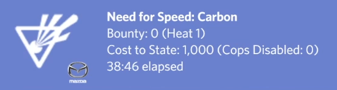

# carbon-rpc
Discord RPC mod for Need for Speed Carbon

## How To Use  
1. Download and extract [Ultimate-ASI-Loader.zip](https://github.com/ThirteenAG/Ultimate-ASI-Loader/releases).  
2. Download and extract [NFSC-RPC.zip](https://github.com/DeaTh-G/carbon-rpc/releases).  
3. Move the asi file into the asi loader's scripts folder folder.
4. Move dinput8.dll to the game's install folder.

## Features
### Race

	

### Free Roam

	

### Pursuit

	

### And more...

## Credits
[ĐeäTh](https://github.com/DeaTh-G) : Creator of carbon-rpc. 
[TripleZet](https://www.deviantart.com/triplezet) : Creator of the HD NFSC logo that's used in the project.
